# GPM Soluções — Serviços de Campo B2B

Aplicação web desenvolvida em **PHP 8.3** e **CodeIgniter 4** com banco de dados **MySQL 8** para gerenciamento de ordens de serviço (corte e nova ligação), equipes de campo, modelos dinâmicos de checklist e controle de estoque de medidores elétricos.

---

## 1. Instalação e Execução

### Pré-requisitos
- **PHP 8.3** (com extensões `intl`, `mbstring`, `mysqlnd`, `pdo_mysql`, `fileinfo`)
- **Composer**
- **MySQL 8.0+**

### Passos de Instalação

1. **Acessar o diretório da aplicação e instalar dependências:**
   ```bash
   cd CodeIgniter
   composer install
   ```

2. **Configuração do Ambiente (`.env`):**
   Copie o arquivo de exemplo caso não possua o `.env` configurado:
   ```bash
   cp .env.example .env
   ```
   Ajuste as credenciais do banco de dados no `.env`:
   ```ini
   database.default.hostname = 127.0.0.1
   database.default.database = seu_banco_b2b
   database.default.username = seu_usuario
   database.default.password = sua_senha
   database.default.DBDriver = MySQLi
   database.default.port     = 3306
   ```

3. **Migrações e Seeds (Preparação do Banco):**
   ```bash
   # Executar as migrações estruturais
   php spark migrate

   # Opcional: inicializar dados de demonstração em banco dedicado
   php spark app:prepare-demo --group demo
   ```

4. **Execução do Servidor Local:**
   ```bash
   php -d upload_max_filesize=10M -d post_max_size=12M spark serve --host 127.0.0.1 --port 8080
   ```
   > O webroot da aplicação é obrigatoriamente `CodeIgniter/public/`.  
   > Acesse: `http://127.0.0.1:8080/login`

### Credenciais de Demonstração (Seeds)

| Papel | E-mail de Acesso | Senha Padrão |
|---|---|---|
| **Gestor** | `gestor@energia.com.br` | `senha123` |
| **Operador** | `operador@energia.com.br` | `senha123` |
| **Eletricista** | `eletricista1@energia.com.br` ou `eletricista2@energia.com.br` | `senha123` |

---

## 2. Estrutura de Diretórios

```
Projeto_Final_Estagio/
├── CodeIgniter/               # Código-fonte principal da aplicação CI4
│   ├── app/                   # Arquitetura MVC e lógica de negócio
│   │   ├── Commands/          # Comandos de CLI (ex: app:prepare-demo)
│   │   ├── Config/            # Configurações de rotas, filtros, banco e uploads
│   │   ├── Controllers/       # Controladores HTTP (OS, Autenticação, Medidores, etc.)
│   │   ├── Database/          # Migrações (Migrations) e Seeds
│   │   ├── Filters/           # Filtros de autenticação, perfil e permissões
│   │   ├── Helpers/           # Helpers customizados (ex: heroicon_helper)
│   │   ├── Models/            # Modelos de dados e mapeamento das tabelas
│   │   ├── Services/          # Regras de negócio, transações e serviços de domínio
│   │   └── Views/             # Templates e telas organizados por módulo
│   ├── public/                # Webroot público (assets CSS/JS/imagens e front controller)
│   │   └── assets/            # CSS próprio, scripts e logo oficial
│   ├── tests/                 # Suíte de testes automatizados (PHPUnit)
│   └── writable/              # Diretório protegido para logs, cache e uploads de fotos
├── database/                  # Scripts SQL de referência
│   ├── schema.sql             # Estrutura completa do banco de dados MySQL
│   └── seeds.sql              # Dados demonstrativos iniciais
├── designs/                   # Protótipos de tela e referências visuais de interface
└── docs/                      # Diagramas e documentação técnica do sistema
    ├── DiagramDeAtividade.md  # Diagrama de atividade do fluxo operacional
    └── DiagramDeEstado.md     # Diagrama de estado do ciclo de vida dos medidores
```

---

## 3. Diagramas do Sistema

### 3.1. Diagrama de Entidade-Relacionamento (ER) do Banco de Dados

Representa a estrutura relacional do sistema MySQL (`tbl_*`), suas chaves primárias, chaves estrangeiras e integridade referencial:

```mermaid
erDiagram
    tbl_usuario ||--o| tbl_eletricista : "possui cadastro técnico (1:1)"
    tbl_usuario ||--o{ tbl_os_historico : "registra ação"
    tbl_usuario ||--o{ tbl_estoque_mov : "movimenta estoque"
    tbl_usuario ||--o{ tbl_anexo : "faz upload"
    tbl_usuario ||--o{ tbl_checklist : "cadastra checklist"
    tbl_usuario ||--o{ tbl_checklist_avaliacao : "avalia / libera"
    tbl_usuario ||--o{ tbl_medidor_reserva : "gerencia reserva"
    tbl_usuario ||--o{ tbl_instalacao_atual : "registra instalacao"
    tbl_usuario ||--o{ tbl_medidor_ocorrencia : "registra ocorrencia"

    tbl_cliente ||--o{ tbl_os : "contrata OS"

    tbl_eletricista ||--o{ tbl_medidor : "detem posse física"
    tbl_eletricista ||--o{ tbl_os : "atribuido a OS"
    tbl_eletricista ||--o{ tbl_os_historico : "executa acao na OS"
    tbl_eletricista ||--o{ tbl_estoque_mov : "responsavel movimento"
    tbl_eletricista ||--o{ tbl_medidor_reserva : "detem reserva"
    tbl_eletricista ||--o{ tbl_medidor_ocorrencia : "responsavel no evento"

    tbl_os ||--o{ tbl_os_historico : "possui historico"
    tbl_os ||--o{ tbl_os_medidor : "registra instalacao/retirada"
    tbl_os ||--o{ tbl_estoque_mov : "vincula movimento"
    tbl_os ||--o{ tbl_anexo : "possui fotos/documentos"
    tbl_os ||--o{ tbl_medidor_reserva : "vincula reserva"
    tbl_os ||--o{ tbl_instalacao_atual : "origem da instalacao"
    tbl_os ||--o{ tbl_checklist_avaliacao : "possui avaliacao"
    tbl_os ||--o{ tbl_medidor_ocorrencia : "vincula ocorrencia"

    tbl_medidor ||--o{ tbl_os_medidor : "historico na OS"
    tbl_medidor ||--o{ tbl_estoque_mov : "movimentado em"
    tbl_medidor ||--o{ tbl_medidor_reserva : "objeto da reserva"
    tbl_medidor ||--o| tbl_instalacao_atual : "instalado na UC"
    tbl_medidor ||--o{ tbl_medidor_ocorrencia : "objeto da ocorrencia"

    tbl_checklist ||--o{ tbl_checklist_item : "composto por perguntas"
    tbl_checklist ||--o{ tbl_checklist_avaliacao : "instanciado em"

    tbl_checklist_avaliacao ||--o{ tbl_checklist_resposta : "contem respostas"
    tbl_checklist_item ||--o{ tbl_checklist_resposta : "respondido em"

    tbl_usuario {
        int id_usu PK
        string nome_usu UK
        string cpf_usu UK
        string papel_usu
        int ativo_usu
    }

    tbl_eletricista {
        int id_ele PK
        int usuario_ele FK
        string matricula_ele UK
    }

    tbl_cliente {
        int id_cli PK
        string nome_cli
        string cnpj_cli UK
        string status_cli
    }

    tbl_medidor {
        int id_med PK
        string numero_med UK
        string modelo_med
        string fabricante_med
        string status_med
        string localizacao_med
        int eletricista_posse_med FK
    }

    tbl_os {
        int id_oss PK
        int cliente_oss FK
        int eletricista_oss FK
        string tipo_oss
        string status_oss
        string unidade_consumidora_oss
        string prioridade_oss
        string resultado_oss
    }

    tbl_os_medidor {
        int id_osm PK
        int ordem_servico_osm FK
        int medidor_osm FK
        string tipo_osm
    }

    tbl_medidor_reserva {
        int id_rme PK
        int medidor_rme FK
        int ordem_servico_rme FK
        int eletricista_rme FK
        string status_rme
    }

    tbl_instalacao_atual {
        int id_ins PK
        int medidor_ins FK
        int ordem_servico_ins FK
        string unidade_consumidora_ins
    }

    tbl_checklist {
        int id_chk PK
        string nome_chk
        string tipo_os_chk
        string etapa_chk
        int ativo_chk
    }

    tbl_checklist_item {
        int id_chi PK
        int checklist_chi FK
        string pergunta_chi
        int resposta_esperada_chi
        string nivel_chi
        int ordem_chi
    }

    tbl_checklist_avaliacao {
        int id_cav PK
        int ordem_servico_cav FK
        int checklist_cav FK
        string etapa_cav
        int bloqueada_cav
    }

    tbl_checklist_resposta {
        int id_cre PK
        int avaliacao_cre FK
        int item_cre FK
        int resposta_cre
        string observacao_cre
    }

    tbl_anexo {
        int id_anx PK
        int ordem_servico_anx FK
        string arquivo_anx
        string tipo_anx
    }

    tbl_estoque_mov {
        int id_emv PK
        int medidor_emv FK
        int ordem_servico_emv FK
        string tipo_emv
        string motivo_emv
    }

    tbl_medidor_ocorrencia {
        int id_ome PK
        int medidor_ome FK
        int ordem_servico_ome FK
        string tipo_ome
    }
```



---

### 3.2. Diagrama de Atividade — Fluxo Operacional de Atendimento

Mapeia o ciclo de ponta a ponta: autenticação, abertura e atribuição de OS, preenchimento e avaliação de checklist de início, execução do serviço em campo (Nova Ligação ou Corte), tratamento de ocorrências, checklist de fechamento e encerramento com conciliação.

```mermaid
flowchart LR
    Start([Início]) --> Login[Usuário realiza login]
    Login --> AuthCheck{Credenciais válidas e usuário ativo?}
    AuthCheck -->|Não| ErroLogin[Exibe erro]
    ErroLogin --> EndFail([Fim])
    AuthCheck -->|Sim| Perfil{Perfil do usuário?}

    %% ===================== CRIAÇÃO E ATRIBUIÇÃO =====================
    Perfil -->|Operador ou Gestor| CriarOS[Solicita OS: empresa, tipo, UC, endereço, prioridade]
    CriarOS --> OS_Aberta[OS: aberta]

    OS_Aberta --> AtribuirOS[Gestor atribui eletricista]
    AtribuirOS --> OS_Atribuida[OS: atribuida]

    %% ===================== ACESSO DO ELETRICISTA =====================
    Perfil -->|Eletricista| MinhasOS[Tela Meus atendimentos]
    OS_Atribuida --> VerificaVinculo{OS atribuída a este eletricista?}
    MinhasOS --> VerificaVinculo
    VerificaVinculo -->|Não| SemAcesso[Sem permissão]
    SemAcesso --> EndFail

    VerificaVinculo -->|Sim| CheckCancel{OS foi cancelada?}

    %% ===================== CANCELAMENTO =====================
    CheckCancel -->|Sim| OS_Cancelada[OS: cancelada]
    OS_Cancelada --> TemMedidorReserva{Possui reserva ou posse pendente?}
    TemMedidorReserva -->|Sim| DevolveMedidor[Devolução pelo eletricista em Meus medidores]
    TemMedidorReserva -->|Não| EndCancel([Fim])
    DevolveMedidor --> EndCancel

    %% ===================== PREPARAÇÃO E CHECKLIST INÍCIO =====================
    CheckCancel -->|Não| TipoOS{Tipo da OS?}

    TipoOS -->|Nova Ligação| VerificaPosse{Eletricista possui medidor elegível em posse?}
    VerificaPosse -->|Não| RetiraDeposito[Eletricista retira medidor no depósito via Meus medidores]
    RetiraDeposito --> VerificaPosse
    VerificaPosse -->|Sim| ChecklistInicio[Preenche checklist de início]

    TipoOS -->|Corte| ChecklistInicio

    %% ===================== AVALIAÇÃO DO CHECKLIST DE INÍCIO =====================
    ChecklistInicio --> AvaliaInicio{Tem item BLOQUEANTE reprovado?}
    AvaliaInicio -->|Sim| BloqueioAbertura[Condição: BLOQUEIO_ABERTURA]

    BloqueioAbertura --> GestorLibera{Gestor autoriza liberação justificada?}
    GestorLibera -->|Não| CorrigeChecklist[Eletricista corrige respostas]
    CorrigeChecklist --> ChecklistInicio
    GestorLibera -->|Sim| IniciaAtendimento

    AvaliaInicio -->|Não: aprovado ou alerta| IniciaAtendimento[Eletricista inicia atendimento]

    %% ===================== INÍCIO DO ATENDIMENTO =====================
    IniciaAtendimento --> TipoVinculo{Tipo da OS?}
    TipoVinculo -->|Nova Ligação| VinculaMedidor[Vincula medidor em posse à OS]
    TipoVinculo -->|Corte| OS_EmAtendimento[OS: em_atendimento]
    VinculaMedidor --> OS_EmAtendimento

    %% ===================== EXECUÇÃO EM CAMPO =====================
    OS_EmAtendimento --> ExecutaServico[Executa serviço em campo]

    ExecutaServico --> OcorrenciaMedidor{Ocorrência com medidor?}
    OcorrenciaMedidor -->|Extravio ou furto| MarcaPerdido[Medidor: PERDIDO com BO/registro]
    OcorrenciaMedidor -->|Dano ou defeito| MarcaDefeito[Medidor: DEFEITO em trânsito]
    OcorrenciaMedidor -->|Sem ocorrência| AcaoCampo{Serviço da OS?}

    MarcaPerdido --> ChecklistFim
    MarcaDefeito --> ChecklistFim

    AcaoCampo -->|Nova Ligação| InstalaMedidor[Aplica e instala medidor na UC: INSTALADO]
    AcaoCampo -->|Corte| ExecutaCorte[Registra leitura final e executa corte]

    InstalaMedidor --> RetiradaExcepcional{Necessita retirada excepcional?}
    RetiradaExcepcional -->|Sim| RetiraInstalado[Retira medidor com justificativa: volta para EM_TRANSITO]
    RetiradaExcepcional -->|Não| RetirouAntigo
    RetiraInstalado --> RetirouAntigo{Havia medidor antigo retirado?}

    ExecutaCorte --> RetirouAntigo
    RetirouAntigo -->|Sim| MedidorRetiradoTransito[Medidor retirado: INSTALADO para EM_TRANSITO]
    RetirouAntigo -->|Não| ChecklistFim

    MedidorRetiradoTransito --> ChecklistFim[Preenche checklist de fechamento]

    %% ===================== CHECKLIST DE FECHAMENTO =====================
    ChecklistFim --> AvaliaFim{Tem item BLOQUEANTE reprovado?}
    AvaliaFim -->|Sim| BloqueioFechamento[Condição: BLOQUEIO_FECHAMENTO]
    BloqueioFechamento --> CorrigeChecklistFim[Eletricista corrige pendências em campo]
    CorrigeChecklistFim --> ChecklistFim

    AvaliaFim -->|Não: aprovado ou alerta| DefineResultado[Define resultado: executado, parcial ou nao_executado]

    %% ===================== CONCILIAÇÃO E ENCERRAMENTO =====================
    DefineResultado --> RegistraHistorico[Registra histórico da OS e movimentações do medidor]
    RegistraHistorico --> OS_Encerrada[OS: encerrada]
    OS_Encerrada --> PosseSobra{Eletricista possui medidor não instalado em posse?}
    PosseSobra -->|Sim| DevolucaoDeposito[Eletricista devolve ao depósito via Meus medidores: DISPONIVEL ou DEFEITO]
    PosseSobra -->|Não| EndSucesso([Atendimento finalizado])
    DevolucaoDeposito --> EndSucesso

    %% ===================== ESTILOS =====================
    classDef status fill:#d1ecf1,stroke:#0c5460,color:#000
    classDef condicao fill:#fff3cd,stroke:#856404,color:#000
    classDef sucesso fill:#d4edda,stroke:#155724,color:#000
    classDef falha fill:#f8d7da,stroke:#721c24,color:#000
    classDef estoque fill:#e2d9f3,stroke:#4a2c7a,color:#000

    class OS_Aberta,OS_Atribuida,OS_EmAtendimento,OS_Encerrada,OS_Cancelada status
    class BloqueioAbertura,BloqueioFechamento condicao
    class EndSucesso sucesso
    class EndFail,ErroLogin,SemAcesso falha
    class RetiraDeposito,VinculaMedidor,InstalaMedidor,RetiraInstalado,MedidorRetiradoTransito,MarcaPerdido,MarcaDefeito,DevolveMedidor,DevolucaoDeposito estoque
```


